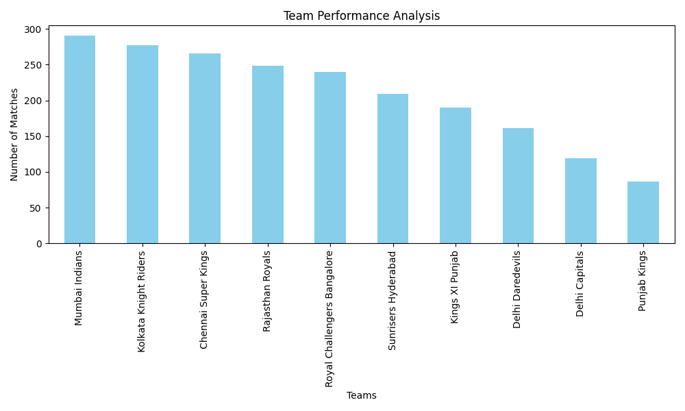
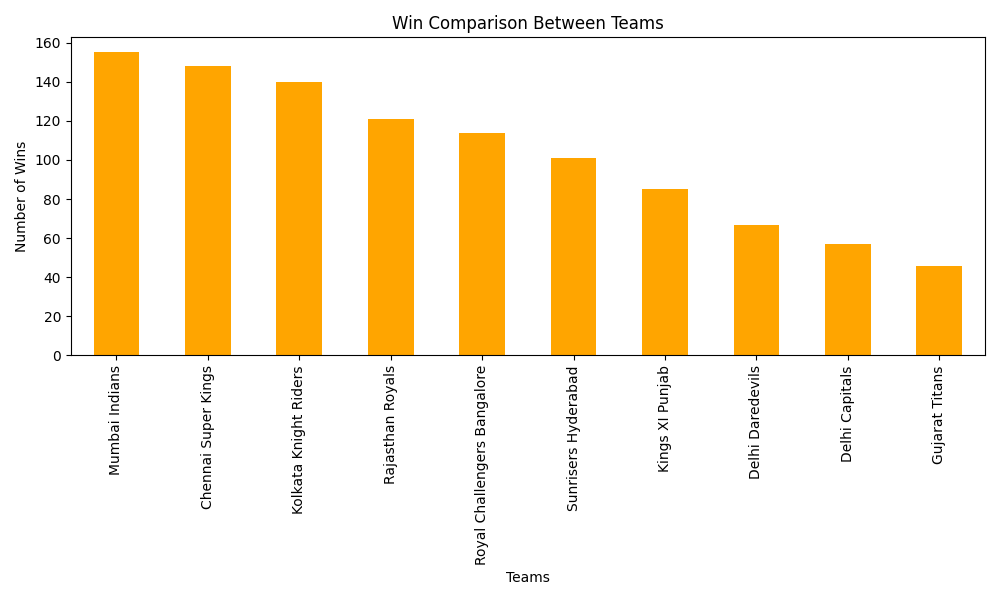
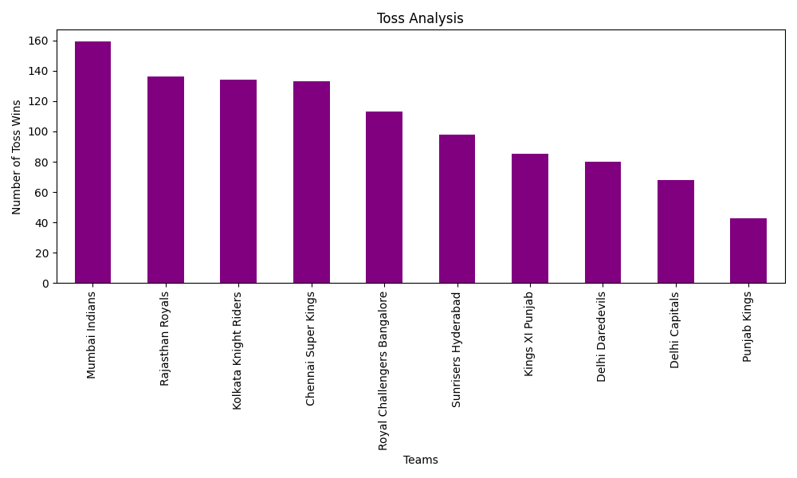
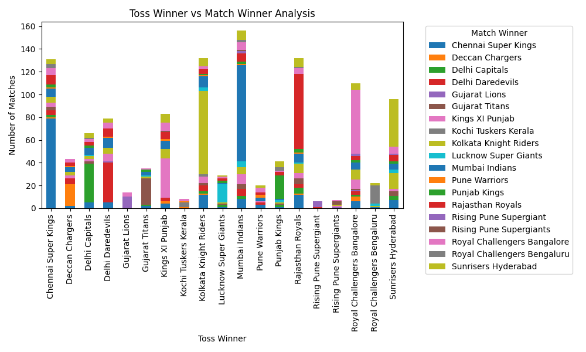
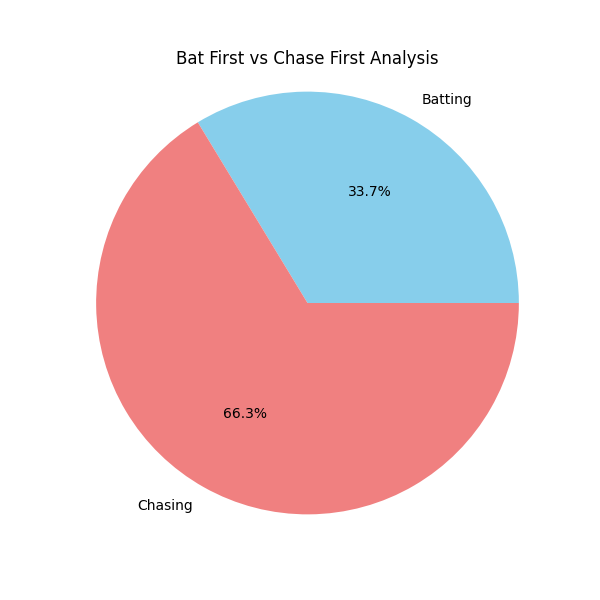
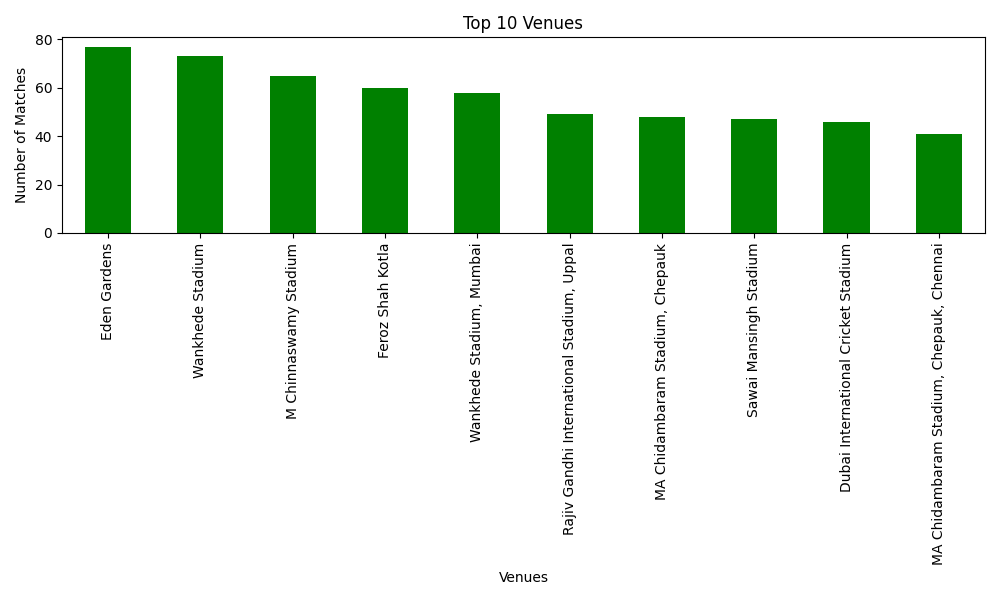
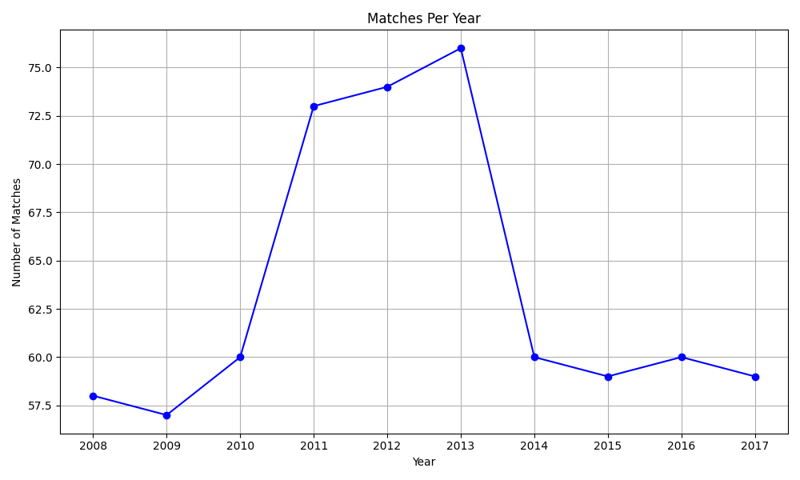
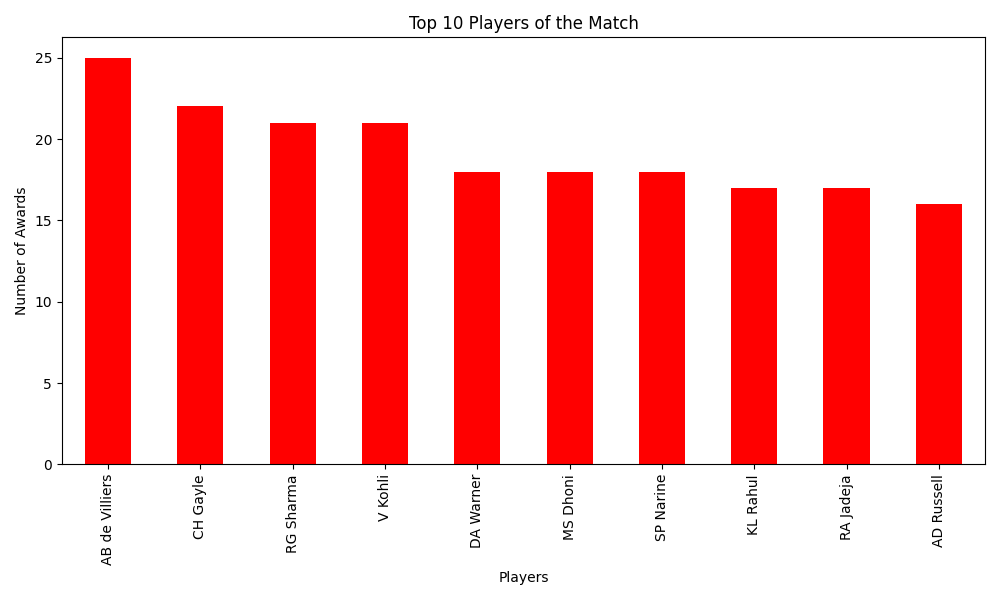

# IPL Data Analysis 🏏

This project is based on IPL match data analysis using Python.  
I explored different IPL teams, match results, toss decisions, venues, and player performances using Pandas and Matplotlib.

---

## About Project

In this project, I explored IPL match data to find useful insights such as:

- Team performance  
- Toss impact on matches  
- Winning Pattern Analysis (year-wise team performance trends)
- Venue analysis  
- Player of the match analysis  

I also created charts and graphs for better understanding of the data.

---

## Dataset

IPL match-level dataset obtained from a GitHub repository and used for exploratory data analysis, visualization, and insights generation.

Dataset Source:  Sourced from GitHub (original repository not documented)

## Technologies Used

- Python  
- Pandas  
- Matplotlib  

---

## Analysis Included

### Team Performance
- Most successful teams  
- Win comparison between teams  

### Toss Analysis
- Toss winner vs match winner  
- Bat first vs chase results  

### Venue Analysis
- Matches played in different stadiums  
- High frequency venues  

### Player Analysis
- Most Player of the Match awards  

### Match Trends
- Matches per year

### Winning Pattern Analysis
- Year-wise team performance trends  

---

## 📊 Visualizations

### 1. Team Performance Analysis

### 2. Win Comparison Between Teams

### 3. Toss Analysis

### 4. Toss Winner vs Match Winner

### 5. Bat First vs Chase First

### 6. Venue Analysis

### 7. Matches Per Year

### 8. Top Players

---

## Dataset

The dataset contains IPL match-level data including:

- Match details  
- Team information  
- Toss results  
- Venue and city  
- Match winner  
- Player of the match  

---

## What I Learned

- Data cleaning  
- Data analysis  
- Data visualization  
- Working with real-world datasets using Python  

---

## Conclusion

This project helped me improve my Python and data analysis skills by working on IPL match-level data.
